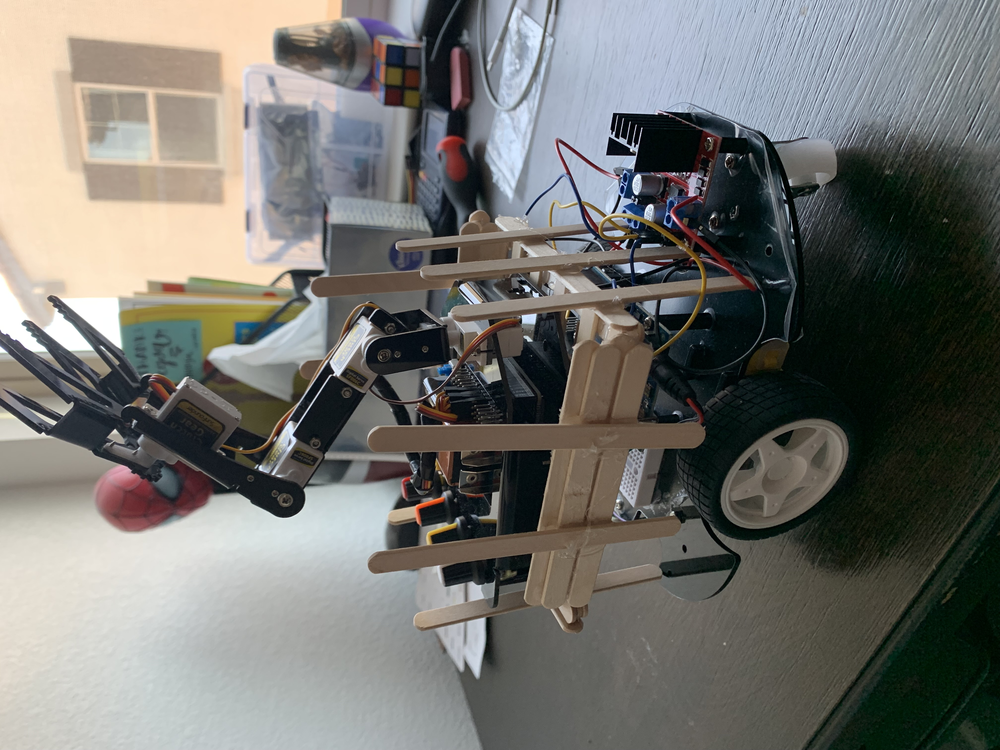
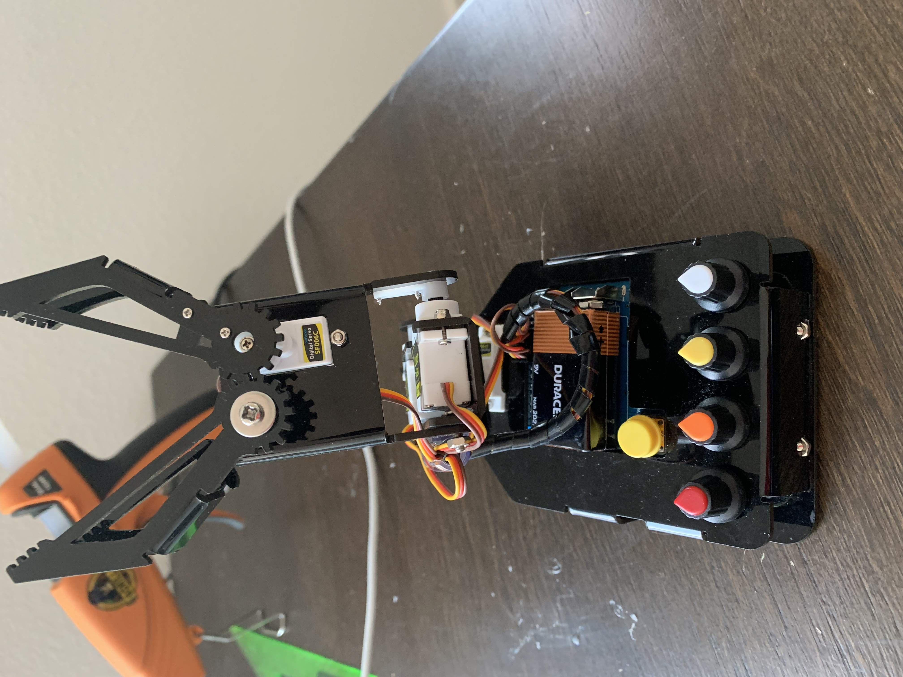
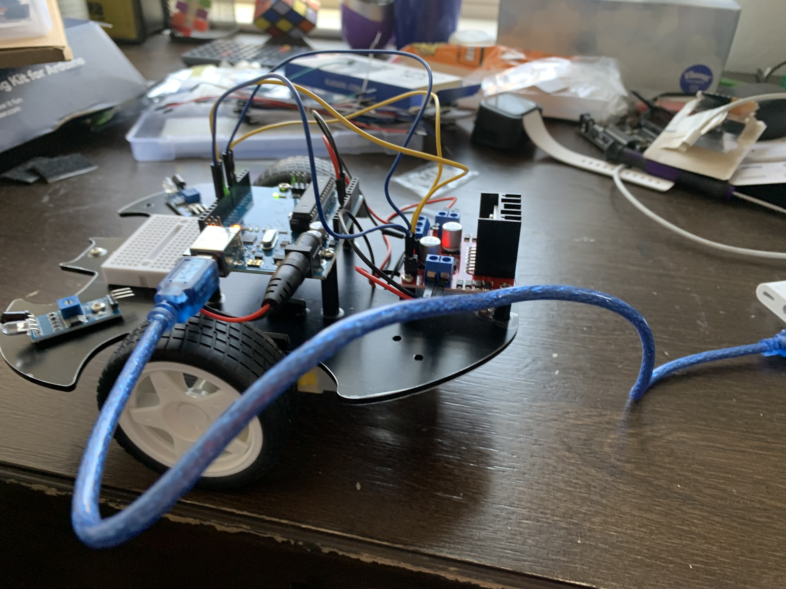
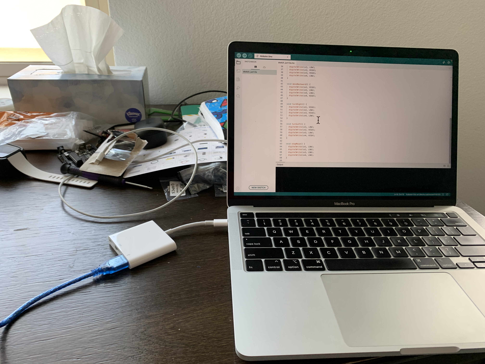
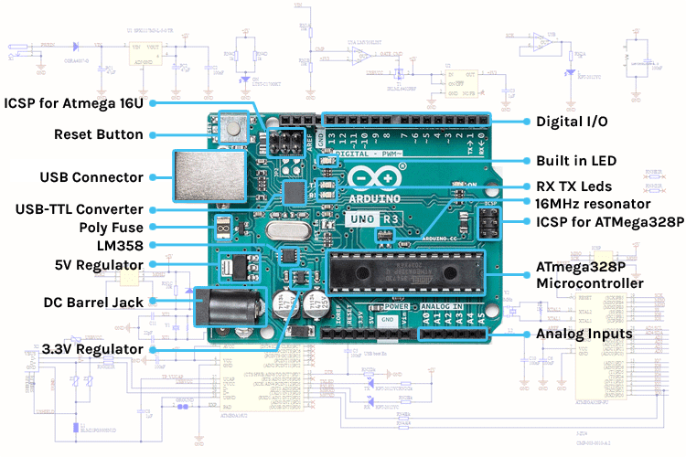
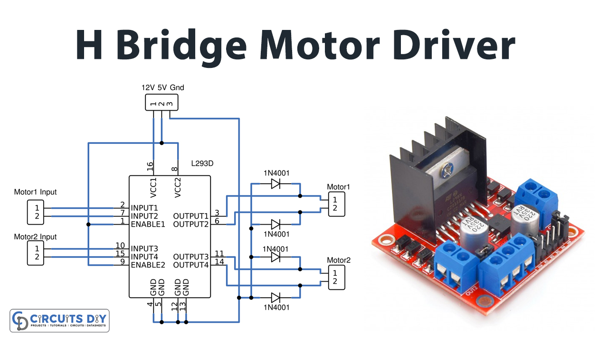

# Ayush's Robotic Arm Smart Car
My project is to build a smart car with a self-cooling system and also a robotic arm to pick up and carry objects. The robotic arm smart car has a fan that turns on/off based on the temperature measured by the thermostat assembled on the smart car. My project also has infrared sensors and a thermostat, each for different functionalities. The infrared sensors are placed underneath the rover to detect ground surface within a 5-centimeter range by emitting light waves and receiving reflected light waves. The thermostat's function is to measure the room temperature, and based on a certain room temperature, the thermostat sends a signal to arduino controller board to either turn on or off the fan. 

| **Engineer** | **School** | **Area of Interest** | **Grade** |
|:--:|:--:|:--:|:--:|
| Aysuh C | Mountain House High School | Mechatronic Engineering | Incoming Senior

**Replace the BlueStamp logo below with an image of yourself and your completed project. Follow the guide [here](https://tomcam.github.io/least-github-pages/adding-images-github-pages-site.html) if you need help.**


  
# Final Milestone
For your final milestone, explain the outcome of your project. Key details to include are:
- What you've accomplished since your previous milestone
- What your biggest challenges and triumphs were at BSE
- A summary of key topics you learned about
- What you hope to learn in the future after everything you've learned at BSE
- 
My final milestone is to integrate my final modification of a self-cooling regulating system. This self-cooling regulating system consists of a fan and a thermostat, and this system works by turning on or off a fan based on the detected room temperature from the thermostat.
- One big problem I had was to assemble the fan and thermostat kit onto my smart car using the breadboard.
- In order to get familiar with the kit, I first tried powering the fan from the rover.
- The fan has two wires, one red and one black wire. The 9-volt battery supplies voltage to flows from the red wire and to exit out from the black wire.
- 
- I powered the fan by plugging the red wire into one of the output pins of the H-bridge to get power from the battery and the black wire into ground level. 
- My future goal of this project is to replace the fan with a machine that send data about temperature at different places and other information like pictures and wind speed to remote systems. This gives us opportunities to learn more about those places to make tasks of gathering information easier for human beings, so they can analyze raw data. 

**Don't forget to replace the text below with the embedding for your milestone video. Go to Youtube, click Share -> Embed, and copy and paste the code to replace what's below.**

<iframe width="560" height="315" src="https://www.youtube.com/embed/F7M7imOVGug" title="YouTube video player" frameborder="0" allow="accelerometer; autoplay; clipboard-write; encrypted-media; gyroscope; picture-in-picture; web-share" allowfullscreen></iframe>

# Second Milestone
My second milestone is completing my robotic arm and integrating it with my smart car.
- My first plan is to make the robotic arm and assemble its parts.
- My second plan is to test the servo motors of the robotic arm to make sure the servos are rotating accordingly to the controls.
- My third plan is to make a stand or a table for the robotic arm to be placed on, and that stand is placed nicely on the rover so when the rover moves, the stand with the robotic arm inside doesn't fall.
- My stand for the rover:
   
- After I assembled my robotic arm, I had to work on controlling my four servo motors. I already got the codebase, so I decided to upload them onto the arduino board of my robotic arm.
- One problem I had was a worry that my servo motors have to move accordingly to the handling of the input devices of the potentiometers. Based on the angle the potentiometers are rotated, the servo motors rotate in the same angle.
- Each servo motor has a corresponding potentiometer that is each connected with an analog pin.
- Assembled robotic arm:
  
- Another problem I faced with my robotic arm was that even thought the one servo motor was spinning, the arm wouldn't move. I realized that stand near the servo motor is not attached to the servo motor. This was a mechanical pproblem, so in order to solve this problem, I used a nut and a screw to attach the servo with the stand. Now, the stand will move with the servo motor.
- One last problem I have is making my robotic claw pick up objects. Even though the corresponding servo rotates, the claws keep twitching. I keep screwing my robotic claw hard, but the clasws don't open and close smoothly. 

**Don't forget to replace the text below with the embedding for your milestone video. Go to Youtube, click Share -> Embed, and copy and paste the code to replace what's below.**

<iframe width="560" height="315" src="https://www.youtube.com/embed/y3VAmNlER5Y" title="YouTube video player" frameborder="0" allow="accelerometer; autoplay; clipboard-write; encrypted-media; gyroscope; picture-in-picture; web-share" allowfullscreen></iframe>

# First Milestone
To complete my project of a rover with a fan and a robotic arm, the first milestone I completed was getting my rover to follow the instructions of my arduino code in order to do basic actions like moving backward, moving forward, and turning towards one direction. I struggled to complete this milestone initially because my rover wouldn’t follow the instructions of my arduino code.
- First, I tried to assemble all the necessary the mechanical parts of my rover before uploading Arduino source code into the arduino board. I decided to get my wire configuration right before testing my rover's positions.
- After I assesmbled my rover's mechanical side, I decideed to work on the software part by working in the Arduino IDE editor.
- In my code, I defined some functions called moveForward (to move forward for a certain time), moveBackward (to move backward for a certain time), turnLeft, and turnRight. Then in the loop function, I coded some instructions that would make the rover move forward and then move backward for a certain amount of time. After these two functions, the rover is instructed to rotate right and then rotate left around itself.
- My assembled rover:
- 
- In order to test my code, I would use an USB adapter to upload my code into the arduino board.
- 
- My problem was that when my rover instructed to move forward, it would instead rotate very fast in the counterclockwise or clockwise direction. 
- The arduino code was right, so I knew there was nothing wrong with the software part of my rover.
- Each TT motor has a black and red wires attached as a terminal for battery voltage. The voltage flows from the positive terminal of the battery to the negative terminal. The voltage starts from the power source and starts out through the red wire. It flows through the 5 volt input power pin to the output pins of the H bridge. The source code is trasnferred from the digital pins to the input pins of the H bridge as well, and in the code, each input pin is assigned to the corresponding or matching number. 
- Arduino board and H Bridge map:
- 
- 
- Solution: I forgot that my motors are set in the opposite direction. Because of this, even though both motors are spinning in the same direction, the opposite set up with make the rover as a system rotate. Due to this problem, I decided to switch the set up of the black and red wires, so the individual motors spin in opposite directions making the rover a system move forward. 
-This is how I fixed this problem.
- Before my final project needs to be completed, I need my rover to move accordingly to the arduino code with the added modifications. 

  

**Don't forget to replace the text below with the embedding for your milestone video. Go to Youtube, click Share -> Embed, and copy and paste the code to replace what's below.**

<iframe width="560" height="315" src="https://www.youtube.com/embed/CaCazFBhYKs" title="YouTube video player" frameborder="0" allow="accelerometer; autoplay; clipboard-write; encrypted-media; gyroscope; picture-in-picture; web-share" allowfullscreen></iframe>

# Schematics 
Here's where you'll put images of your schematics. [Tinkercad](https://www.tinkercad.com/blog/official-guide-to-tinkercad-circuits) and [Fritzing](https://fritzing.org/learning/) are both great resoruces to create professional schematic diagrams, though BSE recommends Tinkercad becuase it can be done easily and for free in the browser. 

# Code for robotic car or rover
Here's where you'll put your code. The syntax below places it into a block of code. Follow the guide [here]([url](https://www.markdownguide.org/extended-syntax/)) to learn how to customize it to your project needs. 

```
void loop() {
    moveForward();
    delay(2000);
    stopMove();
    delay(500);

    moveBackward();
    delay(2000);
    stopMove();
    delay(500);

    turnLeft();
    delay(2000);
    stopMove();
    delay(500);
  
    turnRight();
    delay(2000);
    stopMove();
    delay(500);
}
void moveForward() {
    digitalWrite(in1, LOW);
    digitalWrite(in2, HIGH);
    digitalWrite(in3, HIGH);
    digitalWrite(in4, LOW);
}

void moveBackward() {
    digitalWrite(in1, HIGH);
    digitalWrite(in2, LOW);
    digitalWrite(in3, LOW);
    digitalWrite(in4, HIGH);
}
void turnRight() {
  digitalWrite(in1, HIGH);
  digitalWrite(in2, LOW);
  digitalWrite(in3, HIGH);
  digitalWrite(in4, LOW);
}

void turnLeft() {
  digitalWrite(in1, LOW);
  digitalWrite(in2, HIGH);
  digitalWrite(in3, LOW);
  digitalWrite(in4, HIGH);
}

void stopMove() {
  digitalWrite(in1, LOW);
  digitalWrite(in2, LOW);
  digitalWrite(in3, LOW);
  digitalWrite(in4, LOW);
}
```
#Code for robotic arm
```
/* -----------------------------------------------------------------------------
  Author             : Allen
  Check              : Amy
  Version            : V2.0
  Date               : 12/09/2019
  Description        : Rollarm control program
  Company website    : http://www.sunfounder.com
   ---------------------------------------------------------------------------*/

/* Include ------------------------------------------------------------------*/
// Create servo object to control a servo. 
#include <Servo.h> 

Servo Servo_0;
Servo Servo_1;
Servo Servo_2;
Servo Servo_3;

//#define DataPrint //Uncomment only this to print the data.

//Record the data.
int SensVal[4] = {0}; 

int Joint0[50] = {0}; 
int Joint1[50] = {0};
int Joint2[50] = {0};
int Joint3[50] = {0};

int Dif0[50] = {0}; 
int Dif1[50] = {0};
int Dif2[50] = {0};
int Dif3[50] = {0};

int KeyValue = 0;
int Time = 0;
int M0 = 0, M1 = 0, M2 = 0, M3 = 0;

/*
 - setup function
 * ---------------------------------------------------------------------------*/
void setup() 
{
  //Start the serial for debug.
  Serial.begin(9600);
  
  //Attach the servos on pins to the servo object
  Servo_0.attach(4);
  Servo_1.attach(5);
  Servo_2.attach(6);
  Servo_3.attach(7);
  
  //Set the pin 3 to input
  pinMode(3, INPUT);
  
  //Read the current value of the potentiometer and map it to the angle value.
  ReadPot();
  Mapping0();
  
  //Record the current value of the potentiometer
  M0 = SensVal[0];
  M1 = SensVal[1];
  M2 = SensVal[2];
  M3 = SensVal[3];
}

/*
 - loop function
 * ---------------------------------------------------------------------------*/
void loop() 
{
 //Print the data.
#ifdef DataPrint
  while (1)
  {
    ReadPot();
    Serial.print("SensVal[0]:");
    Serial.println(SensVal[0]);
    Serial.print("SensVal[1]:");
    Serial.println(SensVal[1]);
    Serial.print("SensVal[2]:");
    Serial.println(SensVal[2]);
    Serial.print("SensVal[3]:");
    Serial.println(SensVal[3]);
    delay(200);
  }
#endif

  //Check the button.
  static int Flag = 1;
  Button();
  
  //The time of pressing the button is not long then record the action.
  if ((KeyValue < 10) && (KeyValue > 0))
  {
    KeyValue = 0;
    Record();
    Mapping1(); 
  }
  //Long press the button and open the auto mode ,start repeating the action.
  else if (KeyValue > 10)
  {
    if (Flag == 1)
    {
      Flag = 0;
      Calculate();
    }
    Drive_init();
    delay(3000);
    for (int i = 1; i < Time; i++)
    {
      Drive_repeat(i);
      delay(500);
    }
  }
  //Did not press the button , open the manual mode.
  else
  {
    ReadPot();
    Mapping0();
    
    //The first axis.   
    if ((SensVal[0] - M0) >= 0)
    {
      for (; M0 <= SensVal[0]; M0++)
      {
        Servo_0.write(M0); delay(2);
      }
    }
    else
    {
      for (; M0 > SensVal[0]; M0--)
      {
        Servo_0.write(M0);  delay(2);
      }
    }
    
    //The second axis.    
    if ((SensVal[1] - M1) >= 0)
    {
      for (; M1 <= SensVal[1]; M1++)
      {
        Servo_1.write(M1);  delay(2);
      }
    }
    else
    {
      for (; M1 > SensVal[1]; M1--)
      {
        Servo_1.write(M1);  delay(2);
      }
    }
    
    //The third axis. 
    if ((SensVal[2] - M2) >= 0)
    {
      for (; M2 <= SensVal[2]; M2++)
      {
        Servo_2.write(M2);  delay(2);
      }
    }
    else
    {
      for (; M2 > SensVal[2]; M2--)
      {
        Servo_2.write(M2);  delay(2);
      }
    }
    
    //The fourth axis.    
    if ((SensVal[3] - M3) >= 0)
    {
      for (; M3 <= SensVal[3]; M3++)
      {
        Servo_3.write(M3);  delay(2);
      }
    }
    else
    {
      for (; M3 > SensVal[3]; M3--)
      {
        Servo_3.write(M3);  delay(2);
      }
    }
    
    //Record the current value of the potentiometer
    M0 = SensVal[0];
    M1 = SensVal[1];
    M2 = SensVal[2];
    M3 = SensVal[3];
    delay(10);
  }
}
```

#Code for temperature sensor
```
#include <OneWire.h>
#include <DallasTemperature.h>

// Data wire is conntec to the Arduino digital pin 4
const int oneWireBus = 4;
// Data wire is conntec to the Arduino digital pin 4
#define ONE_WIRE_BUS 4

// Setup a oneWire instance to communicate with any OneWire devices
OneWire oneWire(ONE_WIRE_BUS);

// Pass our oneWire reference to Dallas Temperature sensor 
DallasTemperature sensors(&oneWire);

void setup(void)
{
  // Start serial communication for debugging purposes
  Serial.begin(9600);
  // Start up the library
  sensors.begin();
}

void loop(void){ 
  // Call sensors.requestTemperatures() to issue a global temperature and Requests to all devices on the bus
  sensors.requestTemperatures(); 
  
  Serial.print("Celsius temperature: ");
  // Why "byIndex"? You can have more than one IC on the same bus. 0 refers to the first IC on the wire
  Serial.print(sensors.getTempCByIndex(0)); 
  Serial.print("Fahrenheit temperature: ");
  Serial.println(sensors.getTempFByIndex(0));
  delay(1000);
 
  pinMode(2,INPUT);
  /* 
  if (sensors.getTempCByIndex(0) > -128) {
      digitalWrite(2, HIGH); // sets the digital pin 2 on to provide the power 
      delay(1000); // waits for 1000 miliseconds = 1 second
      Serial.print("The fan should be turned on.");
  }
  else {           
  digitalWrite(2, LOW);  // sets the digital pin 13 off
  delay(1000); // waits for 1000 miliseonds = 1 second
  Serial.print("The fan should be turned off.");
  }
  */

  
  
}
```

# Bill of Materials
Here's where you'll list the parts in your project. To add more rows, just copy and paste the example rows below.
Don't forget to place the link of where to buy each component inside the quotation marks in the corresponding row after href =. Follow the guide [here]([url](https://www.markdownguide.org/extended-syntax/)) to learn how to customize this to your project needs. 

| **Part** | **Note** | **Price** | **Link** |
|:--:|:--:|:--:|:--:|
| Arduino UNO REV3 Microcontroller Board | Used as a motherboard to connect input devices with a power supply and source code to make output devices carry the correct functionality. | $ 28.50 | <a href="https://www.amazon.com/Arduino-A000066-ARDUINO-UNO-R3/dp/B008GRTSV6/"> Link </a> |
|:--:|:--:|:--:|:--:|
| Motor Drive Controller H Bridge | Used to pick up source code and power supply to move the motors accordingly to the arduino code using jumper cables | $ 6.49 | <a href="https://www.amazon.com/Diymall-Module-Stepper-Modules-Arduino/dp/B00NJOTBOK/ref=sr_1_8crid=3MNMJIM3088O2&keywords=arduino+h+bridge&qid=1687547055&s=electronics&sprefix=arduino+h+bridge%2Celectronics%2C129&sr=1-8"> Link </a> |
|:--:|:--:|:--:|:--:|
| Chassis, and TT Motors, TT Wheels Kit | Contains two motors for each one to be connected to each wheel and a chassis (acrylic plate)  | $9.09 | <a href="https://www.amazon.com/Ardokit-Chassis-Encoder-Battery-Arduino/dp/B00K5OWHXO/ref=sr_1_32?crid=1XXQOORADTDRZ&keywords=acrylic+plate+arduino+car&qid=1687549054&sprefix=acrylic+plate+arduino+car%2Caps%2C130&sr=8-32"> Link </a> |
|:--:|:--:|:--:|:--:|
| PKCELL 9V Battery 1 pc| A power supply with a voltage of 9 volts to power my smart car | $ 7.55 | <a href="https://www.amazon.com/Arduino-A000066-ARDUINO-UNO-R3/dp/B008GRTSV6](https://www.amazon.com/PKCELL-Batteries-Alkaline-Detectors-Detector/dp/B0855T49B4/ref=sr_1_23?crid=21BYBZNF2XAL4&keywords=pkcell+battery+9+volt+1pc&qid=1687547725&sprefix=pkcell+battery+9+volt1pc%2Caps%2C137&sr=8-23/"> Link </a> |
|:--:|:--:|:--:|:--:|
| USB Cable| Connects my computer to the Arduino UNO board to trasmit Arduino source code| $ 6.99 | <a href="https://www.amazon.com/DIYmall-Cable-Arduino-2560-Pack/dp/B09JRXT1TY/ref=sr_1_3?crid=1P9JLY2QO6HQJ&keywords=arduino+usb+cable&qid=1687547998&sprefix=arduino+usb+ca%2Caps%2C142&sr=8-3"> Link </a> |
|:--:|:--:|:--:|:--:|
|1'' Universal Wheel 1 pc| Used as additional wheel that can rotate 360 degrees clockwise or counterclockwise, provides support for the two TT wheels, and it set under and behind the two TT wheels  | $1.92 | <a href="https://www.amazon.com/Universal-Casters-Furniture-Trolley-Suitcase/dp/B07HMJ464V/ref=sr_1_5 crid=1HAR0JUZ1O3M6&keywords=1%27%27+universal+wheel&qid=1687548176&sprefix=1%27%27+universal +wheel%2Caps%2C150&sr=8-5"> Link </a> |
|:--:|:--:|:--:|:--:|
| Arduino Jumper Cables | Cables and wires to connect the mini breadboard, Arduino microcontroller board, H bridge, and input devices like IR sensors.  | $ 6.98 | <a href="https://www.amazon.com/Elegoo-EL-CP-004-Multicolored-Breadboard-arduino/dp/B01EV70C78/ref=sr_1_1_sspa?crid=2RWU8S1SQUB7J&keywords=jumper%2Bcables%2Barduino&qid=1687548607&sprefix=jumper%2Bcables%2Barduino%2Caps%2C138&sr=8-1-spons&sp_csd=d2lkZ2V0TmFtZT1zcF9hdGY&th=1"> Link </a> |
|:--:|:--:|:--:|:--:|
| Hot-glue Gun| Used to glue any parts together using glue sticks | $ 14.99 | <a href="https://www.amazon.com/Gorilla-100426-Full-Size-Glue-Orange/dp/B087418ZDN/ref=sr_1_3?crid=3QJY6NH6HHKIU&keywords=gorilla%2Bglue%2Bgun&qid=1687549371&sprefix=gorilla%2Bglue%2Bgun%2Caps%2C145&sr=8-3&th=1"> Link </a> |
|:--:|:--:|:--:|:--:|
| Gorilla Hot Glue Sticks | Used and inserted into hot glue guns | $9.07 | <a href="https://www.amazon.com/Gorilla-Sticks-Diameter-Count-Clear/dp/B071HH42WW/ref=sr_1_1_sspa?crid=30VY1B5ZI2KQP&keywords=hot%2Bglue%2Bsticks&qid=1687549546&sprefix=hot%2Bglue%2Bsticks%2Caps%2C150&sr=8-1-spons&sp_csd=d2lkZ2V0TmFtZT1zcF9hdGY&th=1"> Link </a> |
|:--:|:--:|:--:|:--:|
| 200 Popsicle Sticks| Cables and wires to connect the mini breadboard, Arduino microcontroller board, H bridge, and input devices like IR sensors.  | $ 6.98 | <a href="https://www.amazon.com/Sticks-Natural-Popsicle-Length-Crafts/dp/B07F367TCK/ref=sr_1_3?crid=27RXCEJUZ96XU&keywords=200+pc+popsicle+sticks+KTOJOY&qid=1687549910&sprefix=200+pc+popsicle+sticks+ktojoy%2Caps%2C130&sr=8-3"> Link </a> |
|:--:|:--:|:--:|:--:|


# Other Resources/Examples
One of the best parts about Github is that you can view how other people set up their own work. Here are some past BSE portfolios that are awesome examples. You can view how they set up their portfolio, and you can view their index.md files to understand how they implemented different portfolio components.
- [Example 1](https://trashytuber.github.io/YimingJiaBlueStamp/)
- [Example 2](https://sviatil0.github.io/Sviatoslav_BSE/)
- [Example 3](https://arneshkumar.github.io/arneshbluestamp/)

To watch the BSE tutorial on how to create a portfolio, click here.
